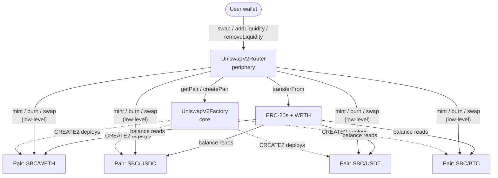
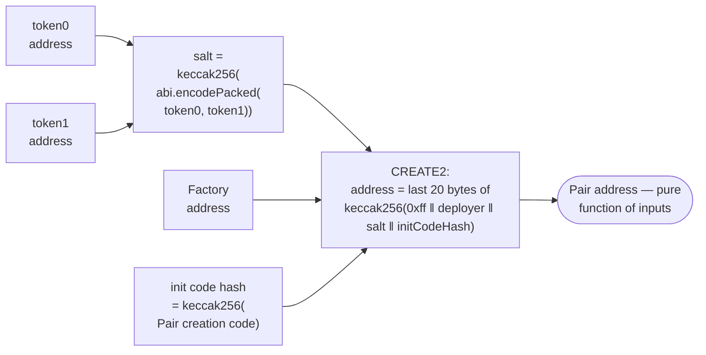
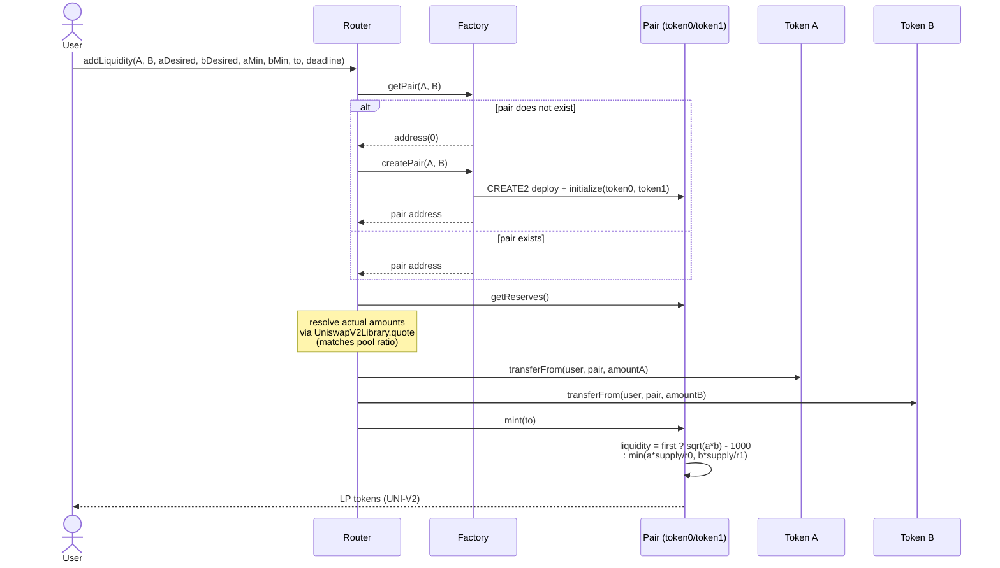
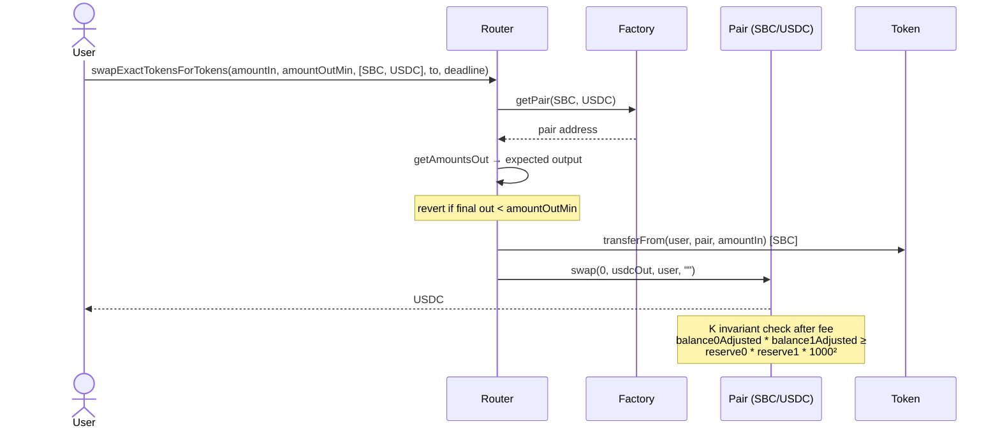
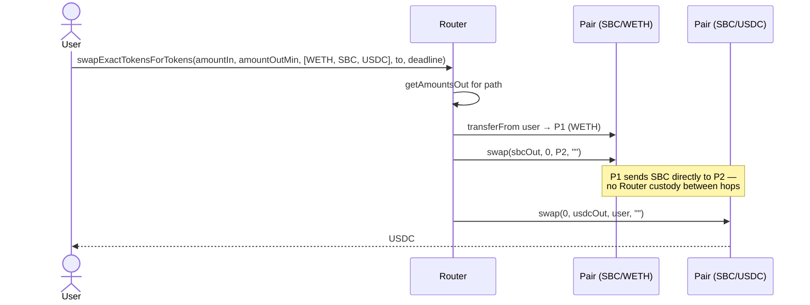
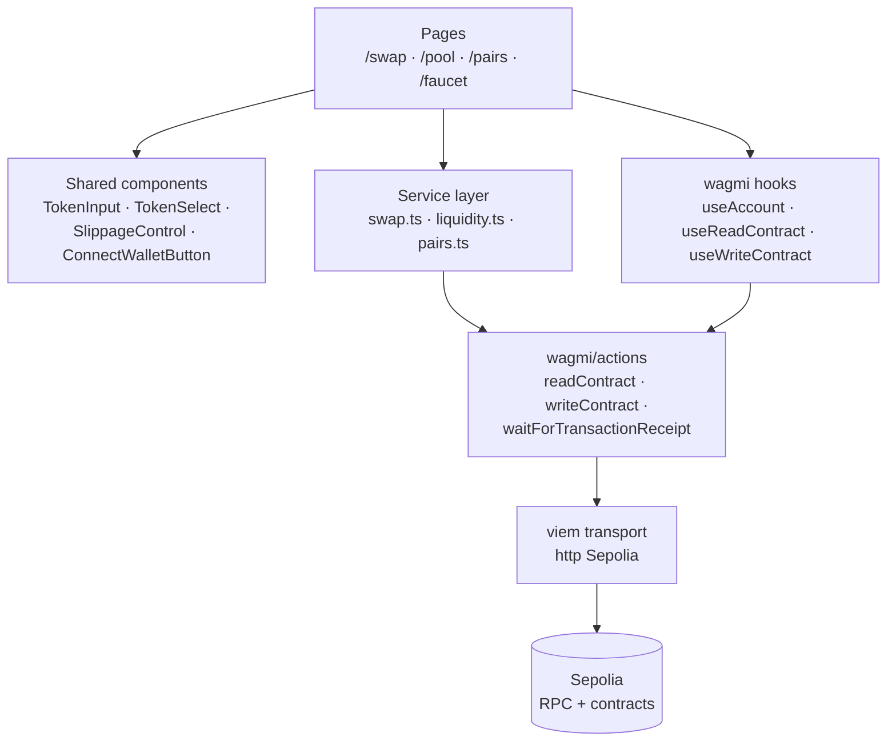

# Sibei's Uniswap V2 Study Build

A full-stack reimplementation of Uniswap V2 written from scratch in Solidity 0.8.24,
deployed to Sepolia, with a React/TypeScript frontend that talks to it via wagmi + viem.

- **Live site**: <https://uniswap.chencraft.com>
- **Repo**: <https://github.com/SibeiC/Papermoon-Intern-Project>
- **Network**: Sepolia (chain id `11155111`)

The original objective was to understand the Factory/Pair/Router separation, the
`CREATE2` opcode that gives V2 deterministic pair addresses, and how the periphery
Router orchestrates multi-hop swaps and slippage. The result is a deployment that
mirrors V2's external behaviour but is original code at a modern compiler version.

---

## Repo layout

```
.
├── contracts/
│   ├── v2-core/                  # Factory, Pair, LP-token base, interfaces
│   │   ├── UniswapV2Factory.sol
│   │   ├── UniswapV2Pair.sol
│   │   ├── UniswapV2ERC20.sol
│   │   └── interfaces/
│   ├── v2-periphery/             # Router, library, periphery interfaces
│   │   ├── UniswapV2Router.sol
│   │   ├── libraries/UniswapV2Library.sol
│   │   └── interfaces/
│   ├── mocks/TestERC20.sol       # configurable ERC-20 with public faucet
│   ├── erc20.sol                 # SibeiCoin (pre-deployed on Sepolia)
│   ├── MockWETH.sol              # WETH9-shaped local mock (unit tests only)
│   └── SimpleCPAMM.sol           # standalone V2-shaped pair (study artifact)
├── test/
│   ├── helpers/v2-fixture.js     # loadFixture helper for tests
│   ├── v2/                       # Factory / Pair / Library / Router tests
│   └── SimpleCPAMM.test.js
├── scripts/
│   ├── deploy.js                 # deploys factory + tokens + router + seeds liquidity
│   ├── verify.js                 # Etherscan source verification
│   ├── redeploy-router.js        # Router-only redeploy (keeps Factory + pairs)
│   ├── copy-abis.js              # extracts ABIs into the frontend
│   └── precheck.js               # checks deployer ETH/SBC balance before deploy
├── deployments/
│   ├── sepolia.json              # live addresses (frontend imports this)
│   └── hardhat.json              # last local dry-run snapshot
├── frontend/
│   ├── src/
│   │   ├── pages/                # /swap, /pool, /pairs, /faucet
│   │   ├── components/           # Layout, ConnectWallet, TokenInput, etc.
│   │   ├── services/             # swap, liquidity, pairs (wagmi/actions wrappers)
│   │   ├── contracts/            # addresses + auto-generated ABIs
│   │   ├── config/wagmi.ts       # wagmi v3 config (Sepolia + injected connector)
│   │   ├── data/tokens.ts        # token metadata sourced from deployments
│   │   ├── hooks/, utils/, types/
│   │   └── main.tsx              # WagmiProvider + QueryClientProvider + Router
│   ├── public/
│   │   ├── tokens/               # locally-served logos (BTC/ETH/USDC/USDT/SBC)
│   │   ├── _redirects            # Cloudflare Pages / Netlify SPA fallback
│   │   └── ...
│   └── vercel.json               # Vercel SPA rewrites
├── hardhat.config.js
└── package.json
```

---

## Smart contracts

### How they fit together



**`UniswapV2Factory`** keeps a registry of all pairs (`getPair[a][b]`, `allPairs[]`)
and is the only contract that deploys `UniswapV2Pair` instances. Each pair has an
empty constructor and is initialized once via `Pair.initialize(token0, token1)`
called by the factory, so pairs can be deployed deterministically via `CREATE2`.

**`UniswapV2Pair`** holds the two token reserves (packed as `uint112, uint112,
uint32 timestamp` in one storage slot), implements LP-token mint/burn, and exposes
a low-level `swap(amount0Out, amount1Out, to, data)` that enforces the constant
product invariant `K_new ≥ K_old` after a 0.3% fee.

**`UniswapV2Router`** is the user-facing periphery. It auto-creates pairs on first
deposit, computes ratio resolution for `addLiquidity`, walks `path[]` arrays for
multi-hop swaps, and wraps/unwraps native ETH against canonical Sepolia WETH.

**`UniswapV2Library`** is `internal` math used only by the Router: `quote`,
`getAmountOut`, `getAmountIn`, `getAmountsOut`, `getAmountsIn`, plus `pairFor` —
which uses runtime `factory.getPair(...)` lookups, **not** the canonical
init-code-hash optimization. That choice avoids the silent-bug class where any
edit to `UniswapV2Pair.sol` (even a comment that affects bytecode metadata)
invalidates the hash and breaks pair lookups across the codebase.

### CREATE2 deterministic addresses



Tokens are sorted before salting (`token0 < token1` numerically) so the same pair
gets the same address regardless of the user's input order. Identity collisions
and zero-address inputs revert in `Factory.createPair`.

### Add-liquidity flow



The first deposit locks `MINIMUM_LIQUIDITY = 1000` LP tokens at `address(1)`
forever — this prevents the share-price-manipulation attack on a freshly drained
pool. Subsequent deposits mint pro-rata LP tokens.

### Swap flow

**Single hop** (e.g. `SBC → USDC`):



**Multi-hop** (e.g. `WETH → USDC` — every seeded pool on Sepolia is SBC-paired,
so this routes via SBC):



The intermediate hop sends its output **directly to the next pair's address**, not
back to the Router. This saves one transfer and matches V2's exact semantics.

### K invariant (after fee)

After every swap, the pair re-reads its on-chain balances and asserts:

```
balance0Adjusted = balance0 * 1000 - amount0In * 3
balance1Adjusted = balance1 * 1000 - amount1In * 3
require(balance0Adjusted * balance1Adjusted >=
        uint(reserve0) * uint(reserve1) * (1000 ** 2),
        "UniswapV2: K");
```

The `* 1000` / `* 3` form is the canonical V2 fee-aware K check in the scaled
domain. The 0.3% fee is deducted from inputs **only for the K check** — the fee
itself stays in the pool and accrues to LPs.

### TWAP (uint224 wraparound)

`_update` accumulates `priceCumulativeLast += UQ112x112(reserveOther / reserveSelf) * timeElapsed`
inside an `unchecked` block. The wraparound is **load-bearing** — TWAP consumers
reconstruct deltas modulo `2^224`. Same for the `uint32` timestamp subtraction:
without `unchecked`, Solidity 0.8 would revert at the next epoch wrap (~136 years).

---

## Frontend

### Layered architecture



- **Pages** own UI state (selected tokens, amounts, slippage, phase).
- **Service layer** wraps the Router/Factory/Pair calls into single async
  functions returning a tx hash; pages await the receipt and invalidate the
  react-query cache so balances refresh.
- **`utils/path.ts`** computes the swap path: direct if either side is SBC,
  otherwise routes via SBC. ETH and WETH share an address, so the `aliasSymbols`
  helper disables both as choices on the opposite side.
- **`utils/tx.ts`** waits for the tx receipt and asserts `status !== "reverted"`.
- **`services/errors.ts`** walks viem's nested `cause` chain to detect wallet-
  rejected requests and rethrows them as a friendly `UserRejectedError`.

### Pages

| Route | What it does |
|---|---|
| `/swap` | Live `getAmountsOut` quote, slippage-aware min-received, ETH↔ERC20 / ERC20↔ERC20 / ERC20↔ETH paths. |
| `/pool` | Add/Remove tabs. **Add** auto-populates the matching side from the live pool ratio (V2 `quote()`). **Remove** computes expected outputs from reserves + totalSupply and applies slippage to both `aMin`/`bMin`. |
| `/pairs` | All pairs read from `Factory.allPairs(i)`, with reserves and short addresses. |
| `/faucet` | One-click `mint(faucetCap)` for USDT/USDC/BTC and a `WETH.deposit{value: 0.01 ether}` button. |

### Service layer in two paragraphs

Every state-changing flow goes through the same shape: the page calls
`await executeSwap(config, params)` (or `addLiquidity`, `removeLiquidity`,
`mint`); the service builds the call args, ensures the relevant ERC-20 allowance
is in place, calls `wagmi/actions.writeContract`, and returns the tx hash. The
page then transitions from `signing` → `confirming` while it
`awaitConfirmation(config, hash)`, then runs `queryClient.invalidateQueries()`
so balance reads in `TokenInput` and the table on `/pairs` refresh against the
new chain state.

Reads (`getAmountsOut`, `getReserves`, `totalSupply`, `balanceOf`, etc.) go
through `useReadContract` / `useReadContracts` so react-query handles caching,
deduplication, and post-tx invalidation. The Pairs page batches the per-pair
reads via `readContracts`, collapsing N round-trips into one multicall.

### Why no Uniswap SDK?

`@uniswap/v2-sdk`'s `Pair.getAddress(...)` hardcodes the canonical V2 init-code
hash to compute pair addresses off-chain via `CREATE2` reverse-lookup. Our
forked Pair has a different bytecode and therefore a different init-code hash,
so the SDK would return wrong addresses. Most of the SDK's value (Trade, Route)
chains through that broken `getAddress`, so we'd end up reimplementing the
useful parts anyway. Direct viem calls + our generated ABIs are clearer for a
forked V2.

---

## Sepolia deployment

| Contract | Address |
|---|---|
| Factory | [`0x9f7e28B6…14Ba0`](https://sepolia.etherscan.io/address/0x9f7e28B69515E305571C42A2A65187acf8914Ba0#code) |
| Router | [`0xc548b561…1594`](https://sepolia.etherscan.io/address/0xc548b5613F70ce26a14b7C85013AD91441601594#code) |
| SBC (SibeiCoin) | [`0xd6f9e7be…519d`](https://sepolia.etherscan.io/address/0xd6f9e7be37ec0d952c01448bd6a4e176641e519d) |
| WETH (canonical Sepolia) | [`0xfFf99767…6B14`](https://sepolia.etherscan.io/address/0xfFf9976782d46CC05630D1f6eBAb18b2324d6B14) |
| USDT | [`0x3533CD68…ac1f`](https://sepolia.etherscan.io/address/0x3533CD68a326AEE55cdcC38eEC569e552578ac1f#code) |
| USDC | [`0x809FB5dc…62bC`](https://sepolia.etherscan.io/address/0x809FB5dc975971762259Be2AAc30C46F28fE62bC#code) |
| BTC (mock) | [`0x1c98882e…d8d2`](https://sepolia.etherscan.io/address/0x1c98882ec570416297Aa94F4c9c7fbfa5D3bd8d2#code) |

| Pair | Reserves seed | Address |
|---|---|---|
| SBC / WETH | 5 000 SBC + 0.833 ETH | [`0x51051f82…dda55`](https://sepolia.etherscan.io/address/0x51051f82158421Af9324B63D8baAFC2a664dda55) |
| SBC / USDT | 5 000 SBC + 2 500 USDT | [`0xd96a408e…cB56`](https://sepolia.etherscan.io/address/0xd96a408eB41DfE42dF2432306Bd0E35392b8cB56) |
| SBC / USDC | 5 000 SBC + 2 500 USDC | [`0x09f495f7…c296`](https://sepolia.etherscan.io/address/0x09f495f7BBFd4c59E55135C63282407c7519c296) |
| SBC / BTC | 5 000 SBC + 0.0417 BTC | [`0xF94Bad8F…Ca043`](https://sepolia.etherscan.io/address/0xF94Bad8Fa46829e5246A98f45092baB300aCa043) |

Every seeded pair has SBC on one side, so any non-SBC swap multi-hops through
SBC. Mock prices are 1 SBC = $0.50, 1 ETH = $3 000, 1 BTC = $60 000.

---

## Local development

### Prerequisites

- Node 20+
- A wallet with Sepolia ETH (only if you're going to redeploy)
- Optional: an Alchemy or Infura Sepolia RPC key (public RPCs are rate-limited)

### Smart contracts

```bash
npm install
npm test                  # 63 tests across Factory / Pair / Router / Library / TestERC20 / SimpleCPAMM
npm run compile           # solc + copy-abis.js (regenerates frontend ABIs)
npm run deploy:local      # in-process Hardhat dry-run; writes deployments/hardhat.json
```

Optional but recommended before any Sepolia deploy:

```bash
cp .env.example .env
# fill in SEPOLIA_RPC_URL, PRIVATE_KEY, ETHERSCAN_API_KEY
npm run deploy:sepolia    # writes deployments/sepolia.json
npm run verify:sepolia    # Etherscan source verification (V2 API)
```

### Frontend

```bash
cd frontend
npm install
npm run dev               # http://localhost:5173
npm run typecheck         # strict TS (noUncheckedIndexedAccess, exactOptionalPropertyTypes, verbatimModuleSyntax)
npm run build             # tsc + vite build (emits dist/)
```

The frontend imports `@deployments/sepolia.json` (alias resolved in `vite.config.ts`
and `tsconfig.app.json`), so any deployment that updates that file is picked up
automatically on the next build.

### Faucets

Sepolia ETH: Alchemy faucet, Google Cloud faucet, QuickNode faucet — any one is
fine. ~0.05 ETH is enough to interact; ~0.5 ETH if you plan to redeploy and seed.

Test tokens: visit `/faucet` on the live site, click the per-token button.

---

## Tests

```
npm test
```

```
SimpleCPAMM ................................. 16 passing
UniswapV2Factory ............................. 9 passing
UniswapV2Pair ............................... 10 passing
UniswapV2Library (via Router) ................ 3 passing
UniswapV2Router — liquidity .................. 5 passing
UniswapV2Router — token-only swaps ........... 5 passing
UniswapV2Router — ETH variants ............... 7 passing
TestERC20 .................................... 7 passing
                                              ─────
                                              63 passing
```

Highlights:

- **CREATE2 determinism** is verified by computing the predicted address with
  `ethers.getCreate2Address(factory, salt, initCodeHash)` and asserting it
  matches `factory.getPair(...)`. A second test deploys two factories and
  confirms the same `(token0, token1)` pair gets distinct addresses, proving
  the determinism is per-deployer.
- **MINIMUM_LIQUIDITY = 1000** is asserted to be locked at `address(1)` after
  the first mint, with `totalSupply == sqrt(a*b)`.
- **K invariant** is exercised by submitting a swap that's exactly correct
  (passes) and one that's 1 wei too greedy (reverts with `"UniswapV2: K"`).
- **Multi-hop** tests build A → B → C through two real pairs and assert the
  final output matches the chained JS-mirror calculation.

---

## Deployment workflow (Vercel)

The frontend lives in `/frontend`; Vercel's project root is configured to
`frontend/`, build command `npm run build`, output directory `dist/`. The SPA
fallback is in `frontend/vercel.json`:

```json
{
    "rewrites": [{ "source": "/(.*)", "destination": "/index.html" }]
}
```

A `_redirects` file is also kept under `frontend/public/` for portability to
Cloudflare Pages or Netlify — Vercel ignores it but doesn't error on it.

Every push to `master` triggers a Vercel deploy. Cache invalidation is
automatic; no manual step needed.

---

## Tech stack

| Layer | Choice | Why |
|---|---|---|
| Solidity | 0.8.24 | matches existing pragma; built-in overflow checks |
| Hardhat | 2.22 + hardhat-toolbox | ethers v6, chai, hardhat-verify all bundled |
| Frontend | Vite 6 + React 19 + strict TypeScript | fast HMR, modern JSX runtime |
| Styling | Tailwind v4 (`@tailwindcss/vite`) | no `tailwind.config.js`, just `@import "tailwindcss"` |
| Web3 | wagmi v3 + viem | typed hooks, native `bigint`, no JSBI |
| State | `@tanstack/react-query` | wagmi peer dep; used directly for the Pairs query |
| Hosting | Vercel | with `vercel.json` SPA fallback |
| Analytics | Cloudflare Web Analytics | beacon in `index.html`, auto-tracks SPA route changes |

---

## License & attributions

This repo is **GPL-3.0**. See [LICENSE](LICENSE).

Token logos served from `frontend/public/tokens/` are sourced from
[`spothq/cryptocurrency-icons`](https://github.com/spothq/cryptocurrency-icons)
under **CC-BY-4.0** for BTC/ETH/USDC/USDT; the SBC logo is the favicon from
<https://github.chencraft.com/>. Full attributions in
[`frontend/public/tokens/NOTICE.txt`](frontend/public/tokens/NOTICE.txt).

The contracts are an original implementation, structured around the same
algorithms (constant-product AMM, `CREATE2`-deterministic pairs, `UQ112.112`
TWAP) as the canonical Uniswap V2. They are not byte-for-byte copies — see the
inline comments in `UniswapV2Pair.sol` and `UniswapV2Router.sol` for the
porting choices made for Solidity 0.8 (drop SafeMath, `unchecked` blocks for
intentional wraparounds, fee-aware K check in the scaled `* 1000` domain).
